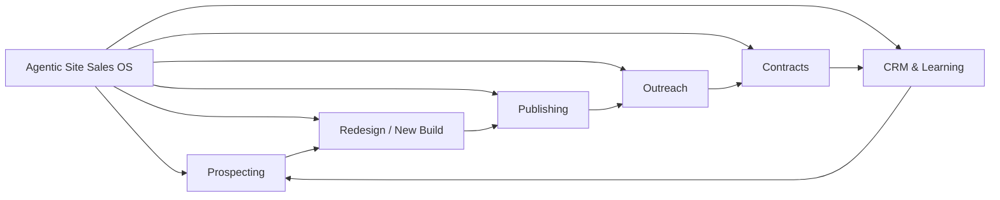

# Agentic Site Sales OS

[](https://github.com/matteuzdev/agentic-site-sales-os/actions/workflows/validate.yml)
[](LICENSE)
[](skills)

An agentic operating system for selling AI-built websites — from lead discovery to paid delivery, one decision at a time.

Built for people who do **not** want to program, manage giant prompts, or memorize a sales pipeline. The orchestrator asks only the questions needed for the current stage, delegates the work to specialist skills, records evidence, and improves the next sales round.

> Tool-agnostic by design: a tutorial may mention Claude, Gemini, ChatGPT, Codex, or another AI. The system preserves the method and maps it to the capabilities available in the current environment.

## What it does

- Qualifies opportunities for both **redesign** and **new sites from scratch**.
- Turns public business evidence into a conversion-focused demo.
- Builds and validates mobile-first pages.
- Publishes a public demo before outreach.
- Prepares personalized WhatsApp or email outreach.
- Tracks replies, objections, proposals, contracts, revenue, and delivery.
- Distinguishes technical validation from the only validation that matters commercially: a paying client.
- Reduces cognitive load to one stage and usually one question at a time.

## Architecture



The repository ships seven skills:

| Skill | Responsibility |
|---|---|
| `agentic-site-sales-os` | Orchestration, progressive questions, state and validation |
| `prospector-prospeccao` | Lead discovery and qualification |
| `prospector-redesign` | Evidence-based redesign and conversion flow |
| `prospector-publicacao` | Public deployment and access validation |
| `prospector-proposta` | Personalized outreach and follow-up |
| `prospector-contrato` | Contract generation and formalization |
| `prospector-crm` | Pipeline, records, contracts and financial tracking |

## Install

### Windows

```powershell
git clone https://github.com/matteuzdev/agentic-site-sales-os.git
cd agentic-site-sales-os
.\scripts\install.ps1
```

The installer copies all skills to `%USERPROFILE%\.codex\skills`. It refuses to overwrite existing skills unless `-Force` is provided.

### Manual

Copy each folder inside [`skills/`](skills) to your agent's skills directory. For Codex on Windows:

```text
C:\Users\<you>\.codex\skills
```

## Start

Invoke the orchestrator:

```text
Use $agentic-site-sales-os to start my site-sales operation.
```

Typical first response:

```text
Stage 0 — Prepare the operation
Next: which city or region should we use for the first client search?
```

The user answers business questions. The agent handles research, implementation details, quality checks, publishing and records.

## Operating model

1. Prepare the offer and working context.
2. Qualify a small pilot batch.
3. Define one commercial job for the page.
4. Build a truthful demo from real evidence.
5. Validate mobile and desktop.
6. Publish a public URL.
7. Send personalized outreach with authorization.
8. Handle replies and objections.
9. Formalize, collect payment and deliver.
10. Measure the funnel and change one hypothesis.

The skill never promises that outreach volume guarantees sales. It records actual conversion rates and learns from evidence.

## Validate locally

```powershell
python .\scripts\validate_skills.py
```

The validator checks skill metadata, folder/name consistency, unresolved placeholders and broken local Markdown links. GitHub Actions runs the same checks on every push and pull request.

## Project status

- Technical validation: automated.
- Operational validation: requires a complete real-lead cycle.
- Commercial validation: requires a closed and confirmed paid client.

## Contributing

See [CONTRIBUTING.md](CONTRIBUTING.md). Improvements should reduce cognitive load, preserve factual integrity, or improve measured conversion — not merely add more instructions.

## License

[MIT](LICENSE) © 2026 Hianto Mateus.
